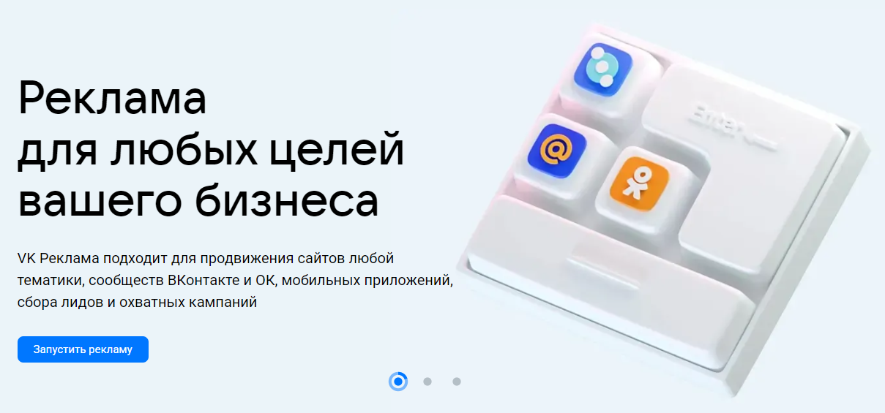
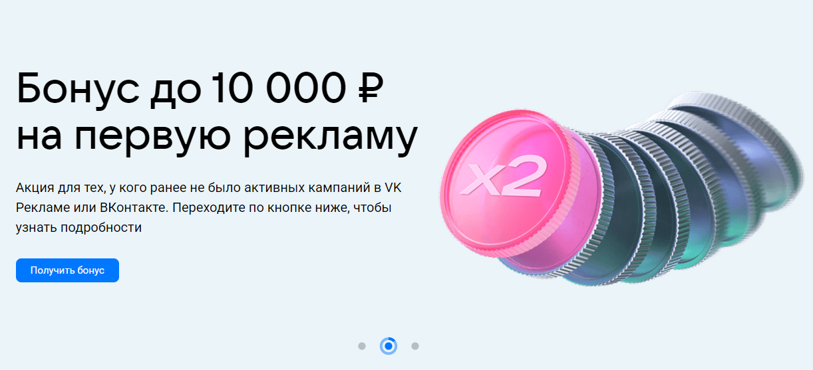
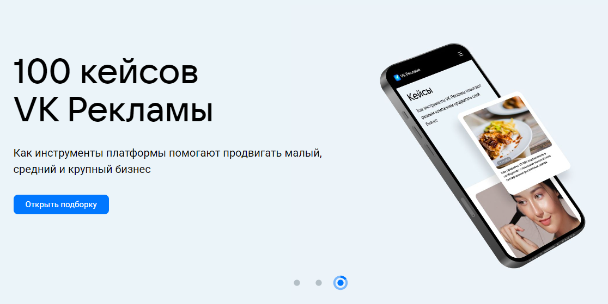

# 1/4 чек-листа команды Fight Club для сайта [ads.vk.com](ads.vk.com)

---

## Содержание

- [Шапка страницы](#0)
- [Главная страница](#1)
- [Новости](#2)
- [Обучение (Полезные материалы)](#3)
- [Обучение (Мероприятия)](#4)
- [Кейсы](#5)
- [Форум идей](#6)
- [Монетизация](#7)
- [? Справка](#8)
- [Регистрация](#9)

---

# Шапка страницы: 

Ссылка: https://ads.vk.ru/

- При нажатии кнопки `VK Реклама` открывается [главная страница](#1)
- При нажатии кнопки `Новости` открывается [страница новостей](#2)
- При нажатии кнопки `Обучение (Полезные материалы)` открывается [страница обучения с материалами](#3)
- При нажатии кнопки `Обучение (Мероприятия)` открывается [страница обучения с мероприятиями](#4)
- При нажатии кнопки `Кейсы` открывается [страница с кейсам](#5)
- При нажатии кнопки `Форум идей` открывается [страница форма с идеями](#6)
- При нажатии кнопки `Монетизация` открывается [страница с монетизацией](#7)
- При нажатии кнопки `? Справка` открывается [страница со справкой о сайте](#8)
- При нажатии кнопки `Регистрация` открывается [страница авторизации](#9)

# 1. Главная страница: 
Ссылка: https://ads.vk.ru/

В начале находится карусель с 3 элементами представленными на фото:
||||
|----------------|----------------|----------------|

- При нажатии на кнопку `Запустить рекламу` происходит переход на [страницу авторизации](#9).
- При нажатии на кнопку `Получить бонус` происходит переход на страницу промоакций.
- При нажатии на кнопку `Открыть подборку` происходит переход на [страницу кейсов](#5).

Далее представлен блок с кейсами компании

При нажатии на кнопку `Смотреть все` открывается [страница кейсов](#5). При нажатии на любой из кейсов открывается страница с подробной информацией о кейсе

Далее блок с обучением

При нажатии на кнопку `Подробнее` или на сам блок открывется [страница обучения с мероприятиями](#4)

Далее блок с новостями о сайте

При нажатии на кнопку `Подробнее` или на сам блок открывается [страница новостей](#2)

# 2. Новости: 
Ссылка: https://ads.vk.ru/news

Здесь представлен полный список новостей с возможностью перейти на каждую новость и узнать о ней подробнее.

- При нажатии на кнопку `Подробнее` или карточку происходит переход на страницу новости с его описанием.

# 3. Обучение (Полезные материалы) 
Ссылка: https://ads.vk.ru/insights

На этой странице представлен списко полезных для обучения материалов с возможностью перейти по каждой статье.

- При нажатии на кнопку `Подробнее` или карточку происходит переход на страницу статьи с подробным его описанием.

# 4. Обучение (Мероприятия) 
Ссылка: https://ads.vk.ru/events

Здесь представлен полный список предстоящих и прошедших мероприятий с возможностью нажать на каждый и узнать подробности.

- При нажатии на кнопку `Подробнее` или карточку происходит переход на страницу мероприятия с подробным его описанием.

# 5. Кейсы: 

Ссылка: https://ads.vk.ru/cases

Здесь представлен полный список кейсов компании с возможностью нажать на каждый и узнать подробности

- При нажатии на кнопку `Подробнее` или карточку происходит переход на страницу кейса с подробным его описанием.

# 6. Форум идей: 
Ссылка: https://ads.vk.ru/upvote

Здесь представлен список идей от пользователей сайта при нажатии на которые открывается подробная информация о идее

Далее находится поля для фильтрации идей

* Поисковая строка

* Выпадающий список тем:
  * Лидформы
  * Сообщества
  * Форум идей
  * Сайты
  * Каталог товаров
  * Мобильные приложения
  * Другое

* выпадающий список статусов
  * Голосование
  * Уже в работе
  * Реализована
  * Отклонено

* Если при использовании фильтров результат отсутствует, то повляется заглушка `Не нашлось идей`

* При нажатии на кнопку `Предложить идею` появляется окно с сообщением о том, что необходимо пройти авторизацию на сайте и потратить не менее 5 000 рублей за 30 дней для того, чтобы получить доступ писать свои идеи.

# 7. Монетизация: 
Ссылка: https://ads.vk.ru/partner

Здесь представлена более подробная информация о монетизации рекламы

При нажатии любой из 2 кнопок `Перейти в кабинет` открывается [страница авторизации](#9)

При нажатии кнопки `Справка` открывается [страница со справкой о сайте](#8)

Далее находится блок демонстрирующий 2 способы работы рекламы

|||
|-----------------|-----------------|

Далее блок вновь предлагающий перейти в личный кабинет, при нажатии кнопки открывается [страница авториции](#9)

После него находится форма обратной связи

При нажатии кнопки `Отправить` без заполнения полей Имя* и E-mail* ничего не просиходит

При нажатии кнопки `Отправить` заполнив поля Имя* и E-mail* будет отрисовано уведомление о принятии формы

# 8. ? Справка: 
Ссылка: https://ads.vk.ru/help

Здесь находятся блоки с руководствами при нажатии на которые можно узнать о них подробнее

Также присутствует поисковая строка

Если ввести некоректную информацию, к примеру несуществующие правило, статистику или просто случайный набор символов и нажать `Enter` отобразится страница заглушка

# 9. Перейти в личный кабинет: 

При нажатии на кнопку `Перейти в кабинет` на любой странице происходит переход на страницу аавторизации, которая предлагает авторизваться через учетную запись ВК.

